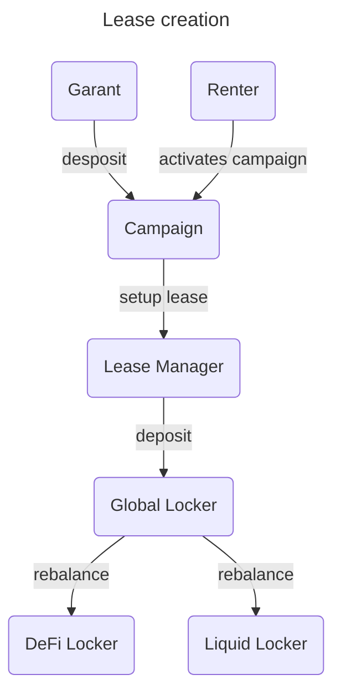
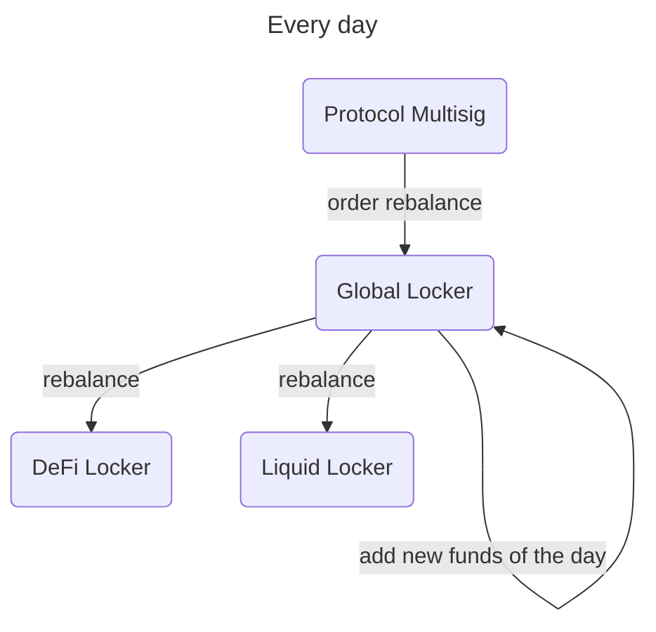
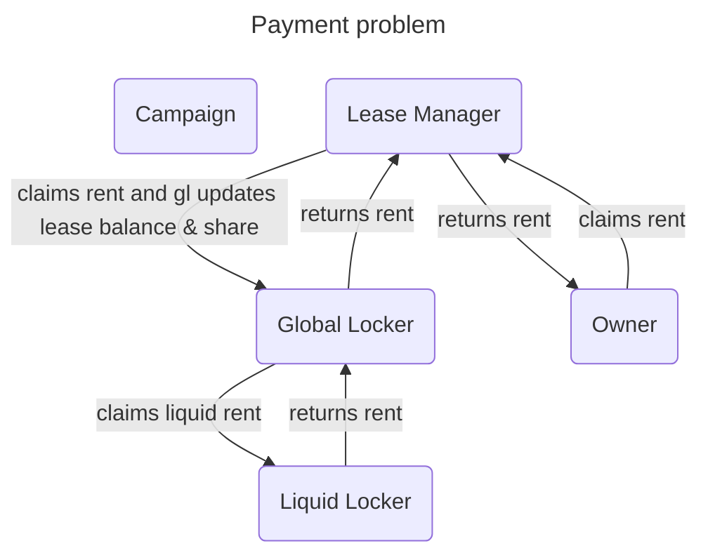
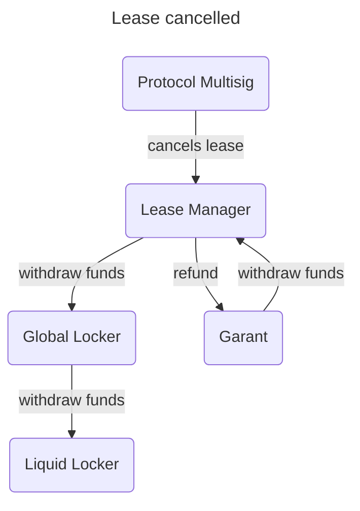

# Contracts

## Campaign

## Protocol Multisig

## LeaseManager

## GlobalLocker

## DeFiLocker

## LiquidLocker

```mermaid
---
title: Lease creation
---
flowchart TD
    cc(Campaign)
    lm(Lease Manager)
    gl(Global Locker)
    dl(DeFi Locker)
    ll(Liquid Locker)
    ga(Garant)
    re(Renter)

    ga -->|desposit| cc
    re -->|activates campaign| cc
    cc -->|setup lease| lm
    lm -->|deposit| gl
    gl -->|rebalance| dl
    gl --> |rebalance| ll

```

```mermaid
---
title: Every day
---
flowchart TD
    pm(Protocol Multisig)
    gl(Global Locker)
    dl(DeFi Locker)
    ll(Liquid Locker)

    pm -->|order rebalance| gl
    gl -->|add new funds of the day| gl
    gl -->|rebalance| dl
    gl --> |rebalance| ll

```

```mermaid
---
title: Payment problem
---
flowchart TD
    cc(Campaign)
    lm(Lease Manager)
    gl(Global Locker)
    ll(Liquid Locker)
    ow(Owner)

    ow -->|claims rent| lm
    lm -->|claims rent and gl updates lease balance & share| gl
    gl -->|claims liquid rent| ll
    ll -->|returns rent| gl
    gl -->|returns rent| lm
    lm -->|returns rent| ow
```

```mermaid
---
title: Lease cancelled
---
flowchart TD
    lm(Lease Manager)
    gl(Global Locker)
    ll(Liquid Locker)
    ga(Garant)
    pm(Protocol Multisig)

    pm -->|cancels lease| lm
    lm -->|withdraw funds| gl
    gl -->|withdraw funds| ll
    ga -->|withdraw funds| lm
    lm -->|refund| ga

```
