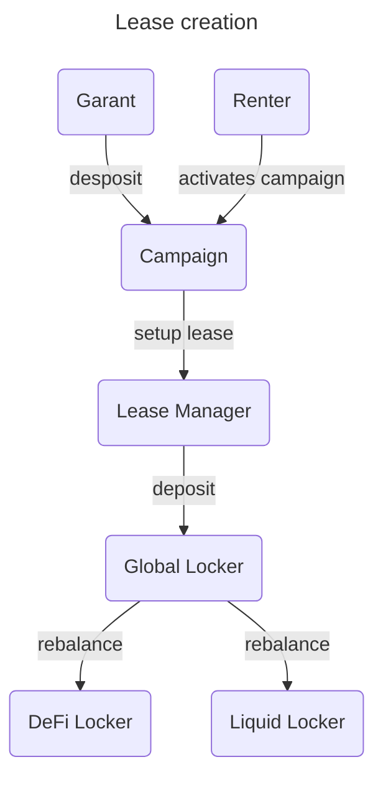
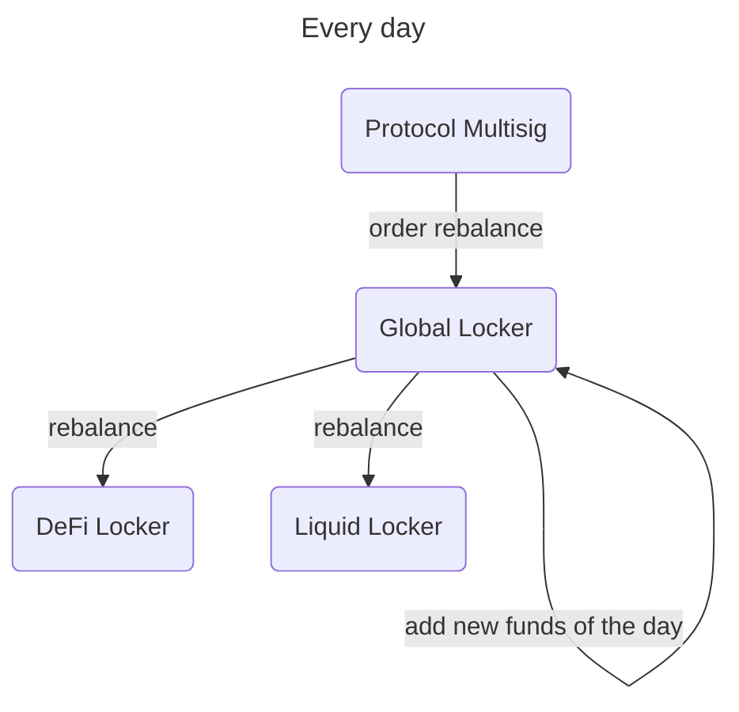
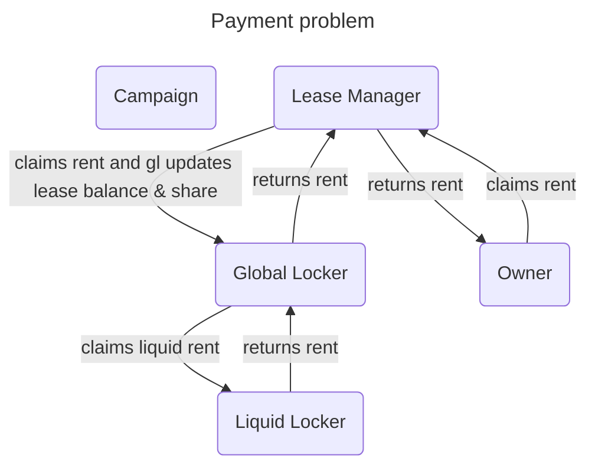
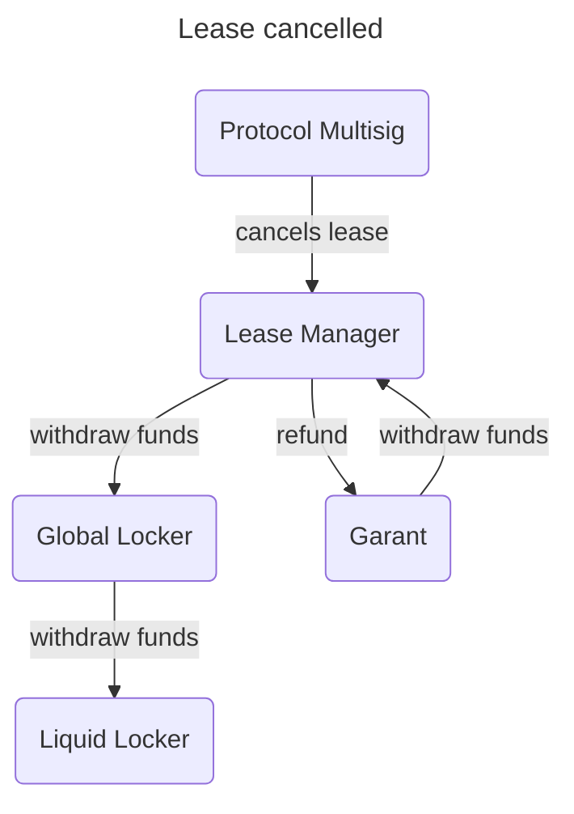

# Contracts

## Campaign
refund_shares() : Fonction permettant aux garants de récupérer leurs fonds en cas d'annulation de la campagne

## LeaseManager
initialize() : Fonction pour initialiser le contrat en transférant le solde des jetons LP au contrat et en approuvant le GlobalLocker

deposit_rent(amount: nat) : Fonction permettant au locataire de déposer des fonds pour payer le loyer

claim_rent() : Fonction permettant au propriétaire de réclamer le loyer. Le loyer est calculé en fonction de la période écoulée depuis le dernier paiement

exit() : Fonction permettant aux utilisateurs de quitter le contrat après l'expiration du bail. Les fonds sont retirés du GlobalLocker et renvoyés à l'appelant

## GlobalLocker
addLease(defiShare: nat, locked_tokens: nat) : Fonction permettant de rajouter un bail avec une part DeFi et un nombre de jetons verrouillés

rebalance() : Fonction appelé tous les jours permettant d'assurer l'équilibrage entre la partie DeFi et la partie liquide

withdraw(amount: nat, receiver: address) : Fonction permettant de retirer des jetons du contract en fonction de la part du bail de l'appelant

## DeFiLocker
set_global_locker(gl: address) : Fonction permettant de créer la pool contenant toutes les liquidités

deposit(amount: nat) : Fonction permettant de déposer des liquidités dans la pool

withdraw(self_balance: nat) : Fonction permettant de retirer des liquidités dans la pool 

# Fees

- premium payment (10%)
- DeFi (15%)
